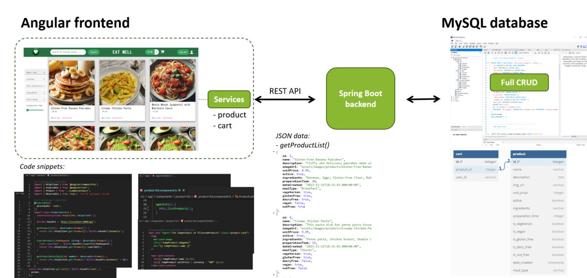
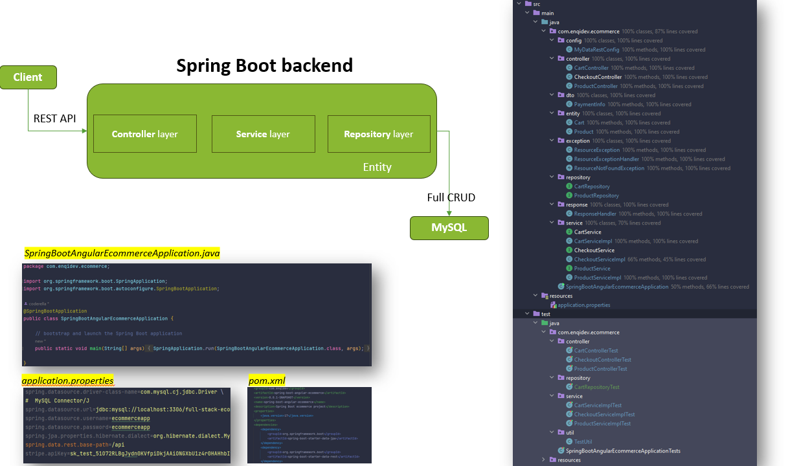
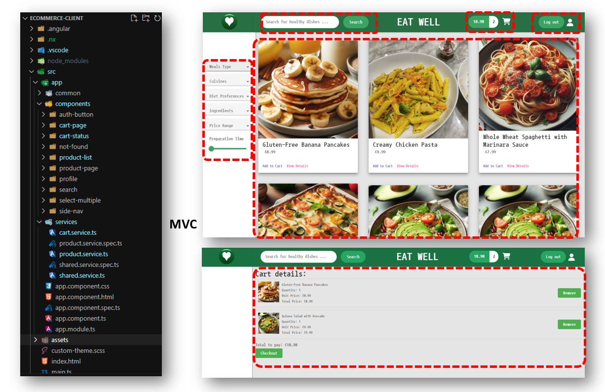
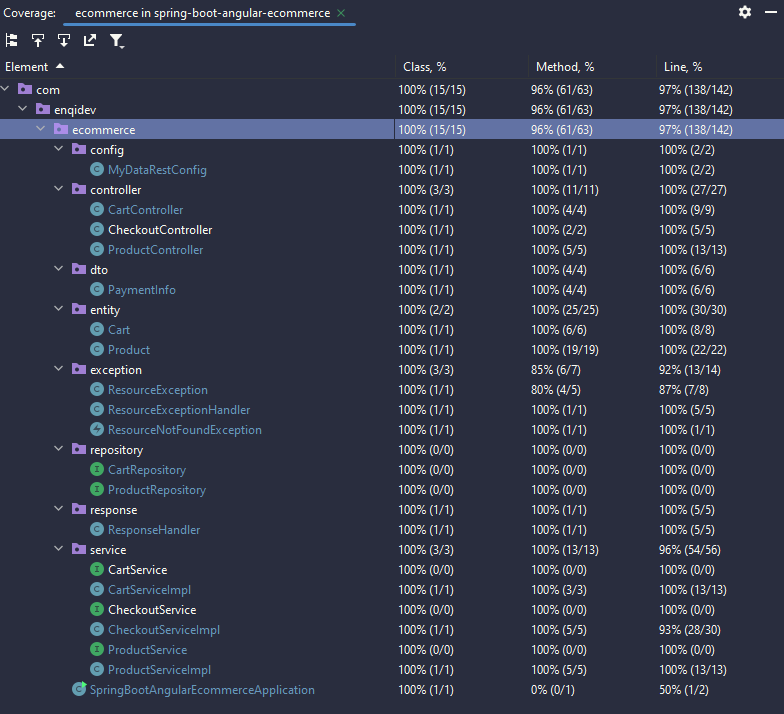
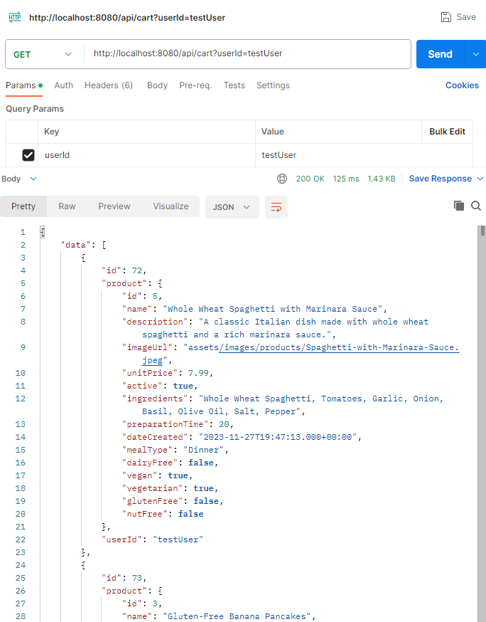
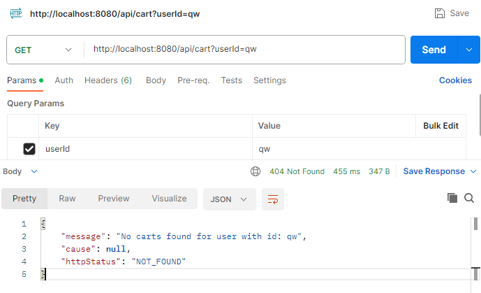

# Eat Well E-commerce Platform - Fullstack Spring Boot Angular MySql

EAT WELL is a simple ecommerce website that brings healthy and yummy food to busy city elite who value their wellness and convenience.

Note: The backend was developed from scratch within a week, despite having no prior experience with Spring Boot. You can find a detailed account of my learning journey during this process at [Log.md](https://github.com/coder3114/Spring-Boot-Angular-eCommerce/blob/master/Log.md).

Table of Contents
- [Tech Stack](#tech-stack)
- [User Requirements](#user-requirements)
- [Demo](#demo)
- [Project Architecture](#project-architecture)
- [Backend Architecture](#backend-architecture)
- [Frontend Structure](#frontend-structure)
- [Release Plan](#release-plan)
- [REST API](#rest-api)
    - [Shopping Cart Operations](#shopping-cart-operations)
    - [Product Operations](#product-operations)
    - [Checkout Operation](#checkout-operations)
- [Testing](#testing)
- [Roadmap](#roadmap)
- [Author](#author)
- [Feedback](#feedback)

## Tech Stack

**Client:** Angular 13, JS ES6, HTML5, CSS3, VS Code

**Server:** Spring Boot 3.1.5, Java 17, Maven, Stripe Java, MySQL 8.0, IntelliJ IDE

## User Requirements

The Eat Well platform addresses the following user requirements:

- Show a List of Products:
    - Display a comprehensive list of available products.
- Filter Products:
    - Allow users to filter products based on categories, dietary preferences, and price ranges.
- Search Products:
    - Implement a search functionality for finding products by keywords.
- Add to Shopping Cart:
    - Enable users to add products to their shopping cart for later purchase.
- Remove from Cart:
    - Allow users to remove products from their shopping cart.
- Shopping Cart Checkout:
    - Implement a secure checkout process for users to finalize their purchases.
- User Login/Logout:
    - Provide secure user authentication for login and logout functionalities.

## Demo

## Project Architecture

## Backend Architecture

## Frontend Structure

## Release Plan

- Release 1.0
    - Show a list of products with a responsive website framework. Using `GET /api/products` API to fetch products data stored in the MySQL database.
- Release 2.0
    - Implement product filtering using Angular MUI. Using URLs to read parameters which were then subscribed by product lists for filtering purposes.
    - Implement searching by keyword features. Using  `GET /api/search/{keyword}` API to fetch the products with keywords.
    - Allow users to add products to their shopping cart. Using `POST /api/addToCart/{productId}` API with userId in the query param to add a specific product in the user's cart.
- Release 3.0
    - Implement user login and logout functionality using Auth0 with security measures.
    - Allow users to remove products to their shopping cart. Using `DELETE /api/cart/{productId}` API with userId in the query param to delete specific product in the user's cart.
    - Integrate shopping cart checkout using Stripe for secure transactions with `POST /api/checkout` API.

## REST API

These APIs provide the necessary endpoints to manage shopping cart operations, handle product information, and process checkouts.

### Shopping Cart Operations

Retrieve the current state of the shopping cart: `GET /api/cart`

Add an item to the shopping cart: `POST /api/addToCart/{productId}`

Remove an item from the shopping cart: `DELETE /api/cart/{productId}`

### Product Operations

Retrieve all available products: `GET /api/products`

Retrieve a specific product by its ID: `GET /api/products/{productId}`

Add a new product to the product list: `POST /api/products`

Search for products by keywords: `GET /api/search/{keyword}`

### Checkout Operations

Initiate the checkout process: `POST /api/checkout`

## Testing

The Spring Boot backend is tested using a combination of JUnit, Mockito, and MockMvc. The tests cover various layers of the application with a code coverage of over `95%`. High code coverage means most of my code is tested. I aim to cover all edge cases to prevent errors and make the app robust.

During the development process, I utilized **Postman** to test all the APIs listed above. This not only enhanced the design of the API but also facilitated the construction of responses that are more client-friendly. For instance,

- `GET /api/cart` retrives user's cart successfully 
    - Query Params: {userId: testUser} (which exists in SQL db)
    - request url: http://localhost:8080/api/cart?userId=testUser
 

- `GET /api/cart` retrives the user's cart not successful, returns message, cause, and httpStatus code in the response body
    - Query Params: {userId: qw} (which does not exist in SQL db)
    - request url: http://localhost:8080/api/cart?userId=qw 

## Roadmap

- **Product List Display:** Implement product list pagination to efficiently handle larger datasets, limiting the display to 10 items per page.
- **Update Cart Functionality:** Develop an `UpdateCart` API to handle `PUT` requests in the shopping cart so that customers can adjust product quantities, eliminating the need for multiple clicks.
- **User Authentication:** Implement secure user authentication on the backend using Spring Security/JWT and Auth0 integration to ensure accurate user information.
- **Admin User Authorization and Protected Routes:** Implement product management functions in the frontend exclusively for administrators. Implement protected routes based on login roles, ensuring appropriate access control.
- **Integration Tests:** Add more integration tests for the backend.
- **Stripe Integration:**
    - Create the DTO without using amount and currency.
    - Validate on the server side to avoid injection attacks.
    - Ensure only authorized users are able to perform payment-related actions.
    - Use HTTPS to encrypt data in transit.
    - Adhere to Stripe's specific requirements for how payment information should be handled and transmitted.
    - Implement secure logging.
    - Dynamically generate line items and payment amounts based on the user's cart at checkout, and return a payment intent object as parameters into the checkout session to the server.
    - Use Webhooks to receive notifications from Stripe when the payment is completed or failed.
    - Increase testing coverage for the checkout service.

## Author

- [@coderella](https://github.com/coder3114)

## Feedback

If you have any feedback, please reach out to [qiangie.yang@gmail.com](mailto:qiangie.yang@gmail.com)
